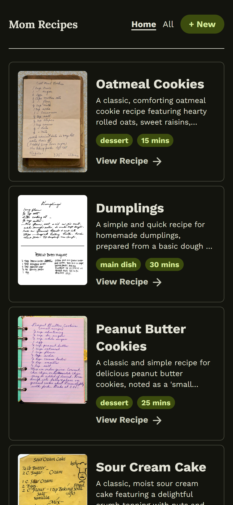
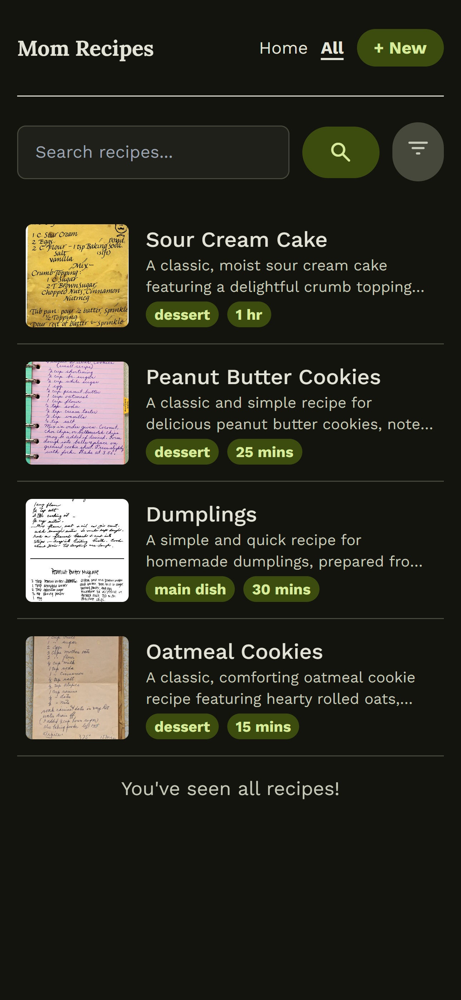
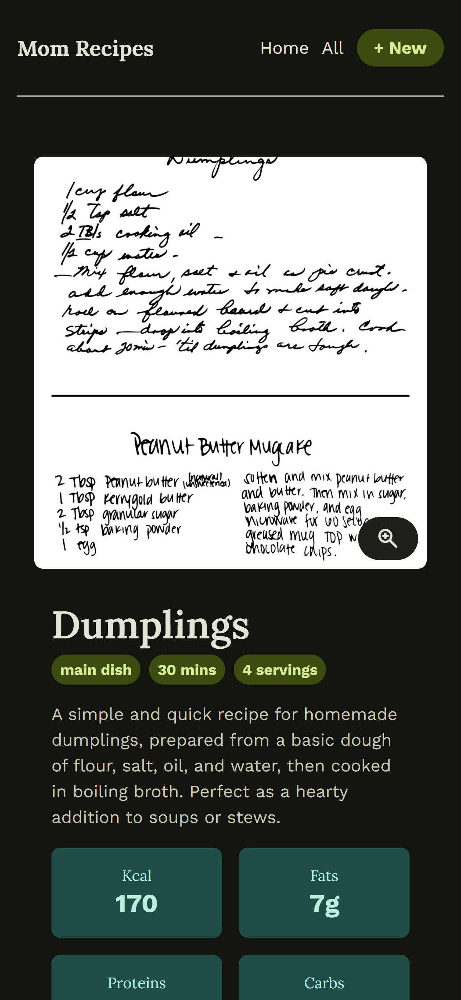
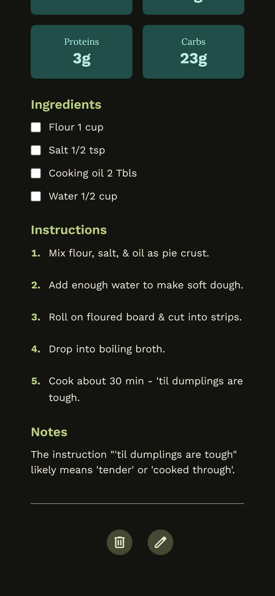
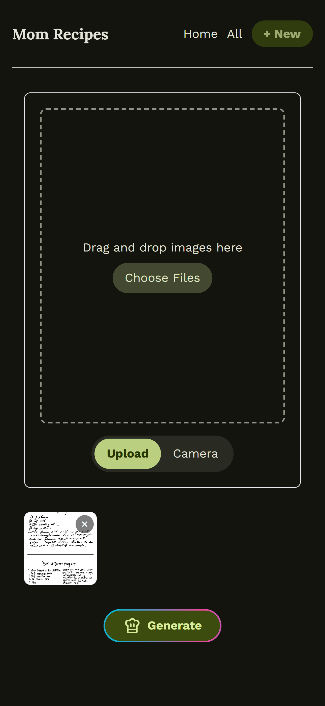
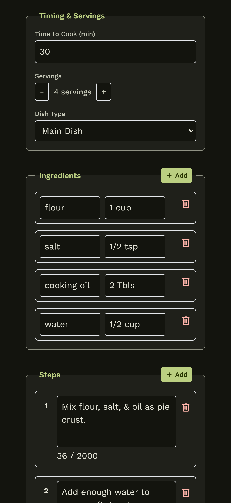

# Mom's Recipes 🍳

Welcome to Mom's Recipes! This is a modern, AI-powered web application designed to bring your family's cherished recipe collections into the digital age. Say goodbye to scattered paper cards and hello to an organized, easily accessible recipe book.

This project was born from a simple idea: to help my mom digitize her beloved recipes and to dive deep into the world of full-stack TypeScript development. It's a blend of practical problem-solving and a passion for learning.

## 🚀 Key Features

-   **AI-Powered Recipe Extraction**: Snap a photo of any recipe—handwritten or printed—and let the AI extract ingredients, instructions, and other details automatically.
-   **Smart Search & Filtering**: Quickly find what you're looking for with a simple search or filter by category.
-   **Interactive Cooking Mode**: Follow along with your recipes easily by checking off ingredients as you use them.
-   **Direct Camera Upload**: Use your device's camera to upload new recipes in high resolution.
-   **Clean, Modern UI**: A beautiful and responsive interface that looks great on any device.

## 📸 Screenshots

Here’s a sneak peek of the app in action on a mobile device:

| | | |
| :---: | :---: | :---: |
| <p>Home</p> | <p>All Recipes</p> | <p>Recipe Details</p> |
| <p>Cooking Mode</p> | <p>Upload Recipe</p> | <p>Edit Recipe</p> |

View more screenshots in the [.images](./images) folder.

## 🛠️ How to Run It

Getting started is easy! Just follow these steps.

### Prerequisites

-   **Docker** and **Docker Compose**: Make sure you have them installed.
-   **Google Gemini API Key**: You'll need one to power the AI features. You can get a free key at [Google AI Studio](https://aistudio.google.com/app/apikey).

### Installation

1.  **Clone the repository:**
    ```bash
    git clone <repository-url>
    cd mom_recipes
    ```

2.  **Set up your environment:**
    Create a `.env` file by copying the example file.
    ```bash
    cp .env.example .env
    ```
    Now, open the `.env` file and add your Gemini API key:
    ```env
    GEMINI_API_KEY=your_actual_gemini_api_key_here
    ```

3.  **Launch the application:**
    Run the following command to build and start all the services:
    ```bash
    docker-compose up --build
    ```
    To run it in the background, use:
    ```bash
    docker-compose up -d --build
    ```

Once everything is up and running, open your browser and go to `http://{your-machine-ip}`.

### 💡 Important Note for Camera Use

Most modern browsers require a secure connection (HTTPS) to access your device's camera. When running the app on your local network, you might need to give your browser permission to treat the local address as secure.

For **Chrome** users:
1.  Go to `chrome://flags/#unsafely-treat-insecure-origin-as-secure`.
2.  Add your server address (e.g., `http://{your-machine-ip}`) to the list.
3.  Enable the flag and restart your browser.

## 💻 Development Mode

If you want to work on the code with hot-reloading enabled for both the frontend and backend, use the development compose file:

```bash
docker-compose -f docker-compose.dev.yaml up
```

## 🛑 Stopping the Application

To stop all running containers:
```bash
docker-compose down
```

To stop the containers and remove all data (including recipes and images):
```bash
docker-compose down -v
```

## 🛠️ Tech Stack

Here's a breakdown of the technologies used in this project:

| Service      | Technology                       | Purpose                               |
| :----------- | :------------------------------- | :------------------------------------ |
| **Frontend** | React 19, TypeScript, Vite       | Modern UI, type safety, and fast builds |
|              | React Router                     | Client-side navigation                |
|              | Tailwind CSS                     | Rapid, utility-first styling          |
| **Backend**  | Node.js, Express, TypeScript     | RESTful API and type-safe logic       |
|              | Google Gemini AI                 | AI-powered recipe extraction          |
| **Database** | PostgreSQL                       | Relational data storage for recipes   |
| **Storage**  | MinIO                            | S3-compatible object storage for images |
| **DevOps**   | Docker, Docker Compose           | Containerization and orchestration    |
|              | Nginx                            | Reverse proxy and static asset serving|


---


Made with ❤️ for Mom. Contributions are always welcome!
